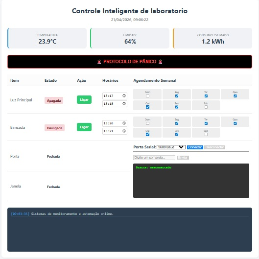

# ControleInteligenteLaboratorio
Controle Inteligente de Laboratório
Este projeto é um sistema de automação para monitoramento e controle de ambientes laboratoriais. Ele utiliza uma interface web moderna para gerenciar dispositivos via comunicação serial, permitindo o controle de iluminação, equipamentos e monitoramento de sensores em tempo real.
🚀 Funcionalidades
Monitoramento em Tempo Real: Visualização de temperatura, umidade e consumo de energia.
Controle de Dispositivos: Interface para ligar/desligar luzes e bancadas de trabalho.
Agendamento Semanal: Programação de horários específicos para ativação automática de itens.
Protocolo de Pânico: Botão de emergência para interrupção imediata ou alertas.
Terminal Serial Integrado: Envio de comandos diretos e leitura de log de sistema via web.
Segurança: Monitoramento do status de portas e janelas.
🛠️ Tecnologias Utilizadas
Frontend: HTML5, CSS3, JavaScript.
Comunicação: Protocolo Serial (9600 Baud padrão).
Backend/Integração: [Inserir tecnologia, ex: Node.js, Python ou PHP].
💻 Visual da Interface

Exemplo da interface de controle exibindo sensores e painel de agendamento.

📖 Uso
Conexão: Selecione a porta e o Baud Rate no painel e clique em "Conectar".
Agendamento: Marque os dias da semana e defina os horários para automatizar as tarefas.
Console: Utilize o terminal inferior para visualizar logs do sistema em tempo real.
